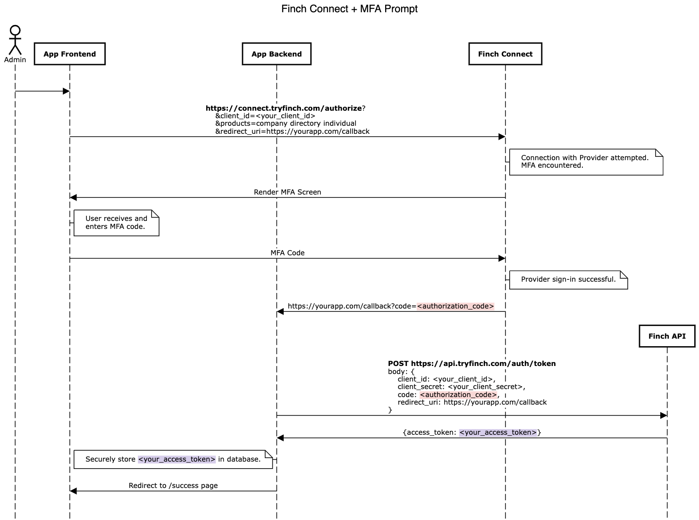
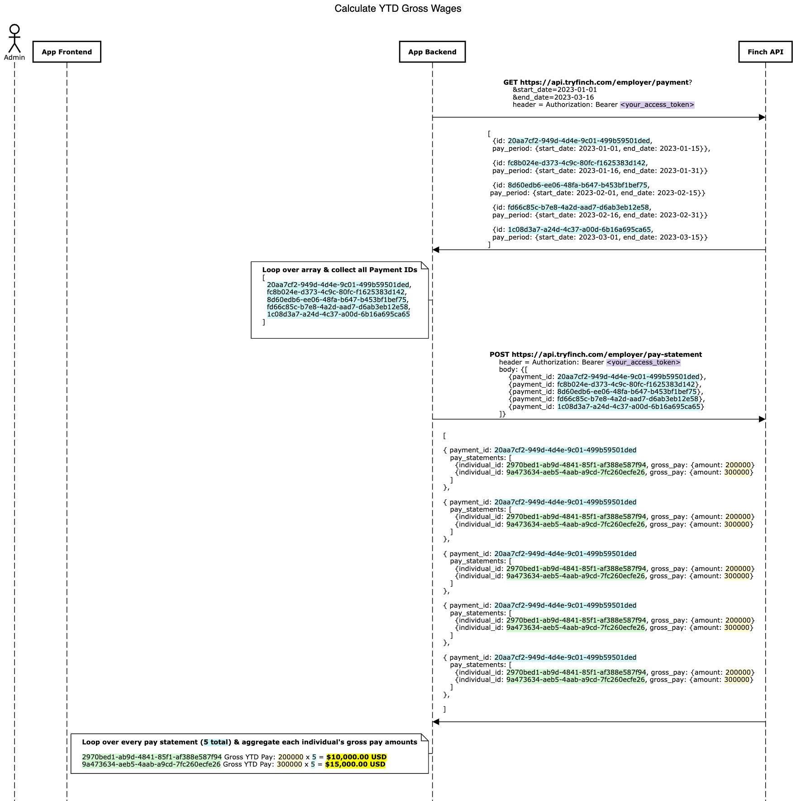
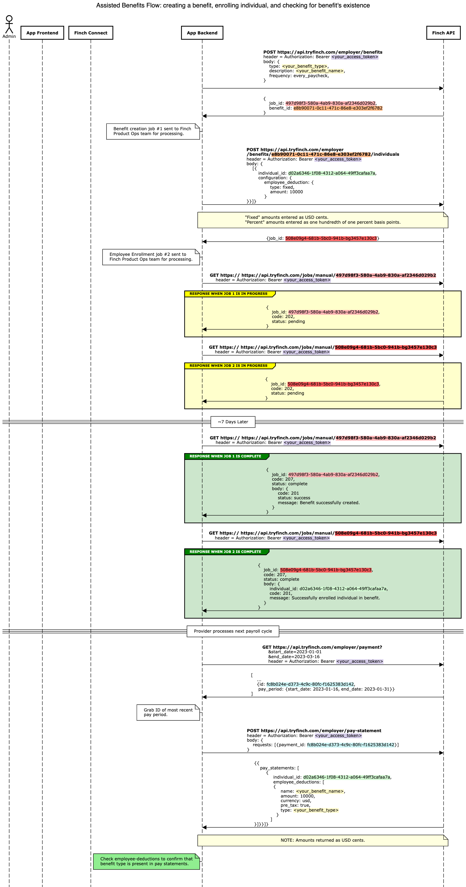

# Use Case Best Practices

Finch APIs have a wide range of use cases. Here, we highlight best practices for some common scenarios through sequence diagrams demonstrating the flow of logic.

### Finch Connect + MFA

### Calculating YTD Gross Wages

### Automated Benefits Flow

### Assisted Benefits Flow

