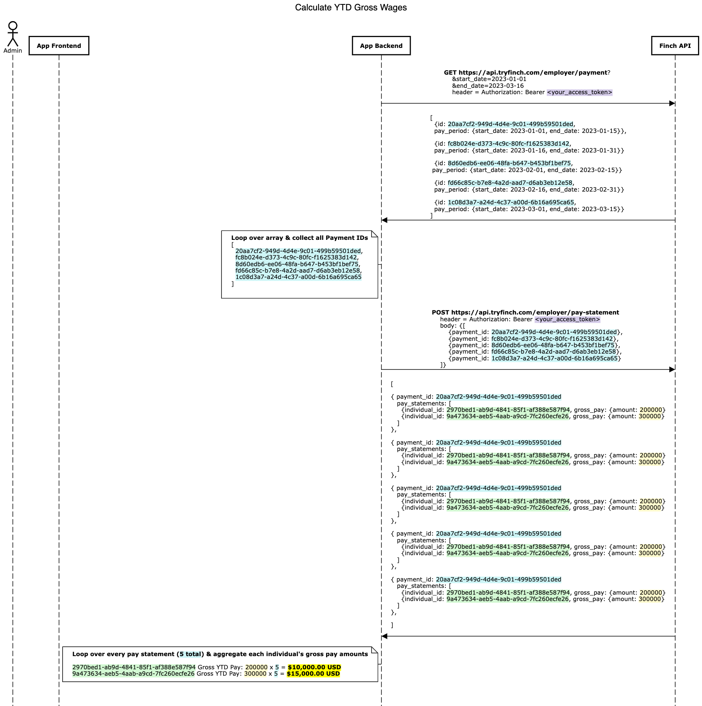

# Calculating YTD Wages

A common use case for Finch APIs is to calculate YTD gross wages for individual employees. This useful and powerful information can be calculated easily by using the right approach.

### Logic Flow

The general flow for calculating individual YTD wages works like this:

1. Call the `employer/payment` endpoint and pass a `start_date` of the first of the year and an `end_date` of the current date.
2. Loop over the array of returned payment objects and collect all of the payment `id`s.
3. Call the `employer/pay-statement` endpoint and pass all of the `payment_id`s in the request.
4. Loop over the array of returned pay statements and aggregate each individual's gross pay amounts.

### Sequence Diagram
