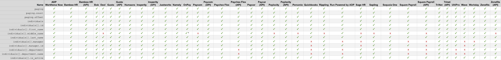
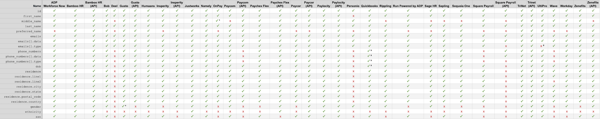

# Field Support Overview

Finch's API attempts to maintain field support parity between all [providers](./Providers.md). However, at times a provider may not support a specific data field (for example: job titles) or Finch may not yet have built support for a particular field. The pages in this section outline the compatibility of each data field for each automated API integration and any other miscellaneous information that's important to know.

### Gusto

---

<!-- theme: info -->

> <strong>✓</strong> — supported
>
> <strong>x</strong> — not supported by Finch

<!--
type: tab
title: HRIS
-->

### Company

<i>* Only available by inferring from entity.type</i> 
<i>** account_number is mask and only shows the last 4 digits</i>

### Directory

<i>* Initial only</i>

### Individual

<i>* Initial only</i> 
<i>** No work email available</i>

### Employment

<i>* Initial only</i> 
<i>** Requires customer to be at highest package tier, ADP Run Pro</i> 
<i>*** These fields are not provided for contractors</i>

### Payment

### Pay Statement

<i>* 401k Match cannot be set on Justworks</i> 
<i>** Paychex Flex only exposes the previous 24 months of pay data</i> 
<i>***Attribute not always available via Paylocity's API</i>

<!--
type: tab
title: ATS
-->

<!-- type: tab-end -->
