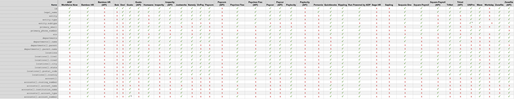
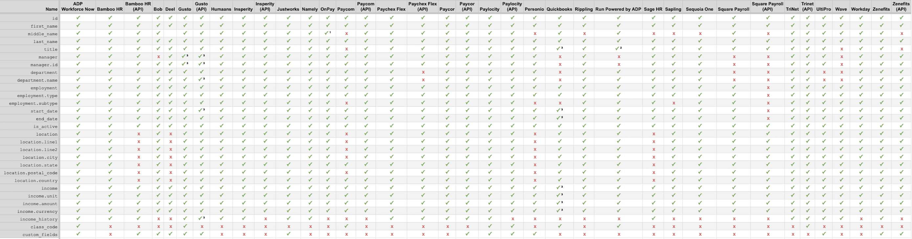
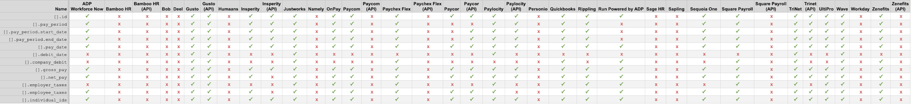

# Organization & Pay Support

Finch's API tries to maintain parity between all [providers](./Providers.md). However, every now and then, a provider may not support a specific data field (for example: job titles). This section outlines the compatibility of each data field per Automated API Integration and any other miscellaneous information that's important to know.

## Supported Data Fields

---

<!-- theme: info -->

> <strong>✓</strong> — supported
>
> <strong>x</strong> — not supported by Finch

### Company

<i>¹ Only available by inferring from entity.type</i> 
<i>² account_number is mask and only shows the last 4 digits</i>

### Directory

<i>¹ Initial only</i>

### Individual

<i>¹ Initial only</i> 
<i>² No work email available</i> 
<i>³ Contractors don't have these fields in the QBO system</i>

<i>⁴ This field is deprecated and may be inaccurate</i>

### Employment

<i>¹ Initial only</i> 
<i>² Requires customer to be at highest package tier, ADP Run Pro</i> 
<i>³ These fields are not provided for contractors</i>

### Payment

### Pay Statement

<i>¹ 401k Match cannot be set on Justworks</i> 
<i>² Paychex Flex only exposes the previous 24 months of pay data</i> 
<i>³Attribute not always available via Paylocity's API</i>

