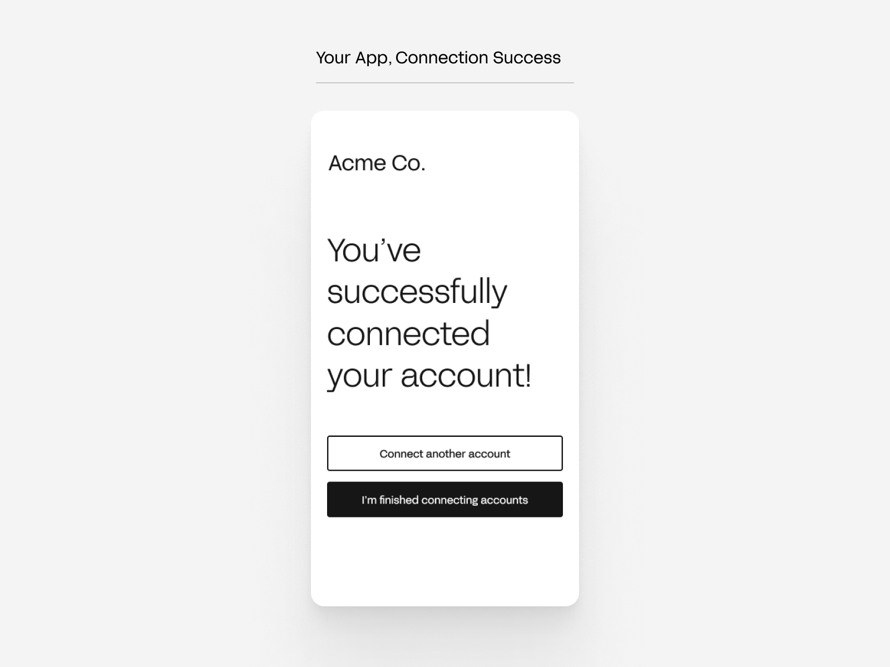
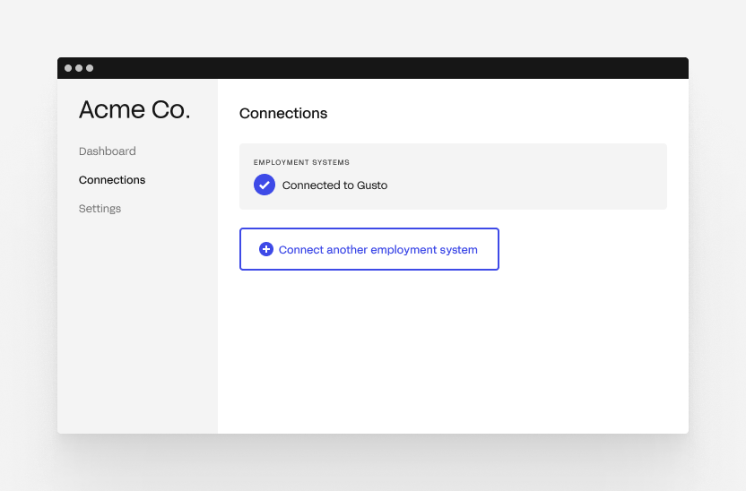
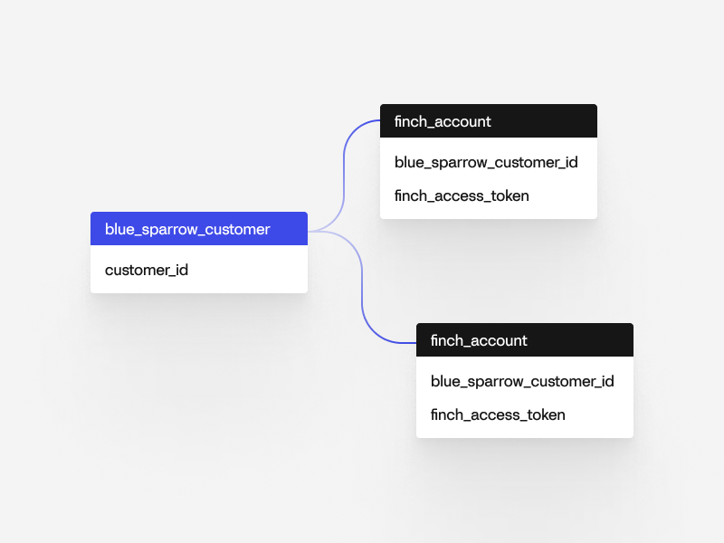

# Multi-account flow

A company can have multiple accounts on the same employment system or accounts across different employment systems. Here are some scenarios where this can happen: 

1. **Pay Groups** — A company has an account per payroll group. Some companies split employees into different payroll groups to pay on different cadences. Some systems require multiple accounts to facilitate this functionality.
2. **Migration** — A company is in the process of migrating systems. Therefore, some data may lie in the old system and some are in the new.
3. **Legal Entities** — A company has separate legal entities usually in the form of divisions (corporations & LLCs), franchises (LLCs), or business units (corporations & LLCs). Each entity can have it's own account.
4. **Foreign workers** — A company has foreign contractors or employees and utilizes a separate payroll or HR system account to manage those individuals. 

<!-- theme: warning -->
> Each Finch `access_token` is associated with a single account. To identify the account, send an API request to the [`/introspect` endpoint](https://developer.tryfinch.com/docs/reference/b3A6MTc3MTk2Njk-introspect).

Each Finch `access_token` is associated with a single account on one employment system. Therefore, to support multi-account customers, your application will need to support multiple `access_token`s per customer. While planning your Finch integration, you will need to consider—
1. how to present Connect to your customer so they connect all of their accounts,
2. designing a flexible database schema to elegantly support multiple `access_token`s, and
3. adding application-level logic to support sending Finch API requests for multiple `access_token`s per customer and reconciling the data accordingly.

## Presenting Connect
To have your user connect multiple accounts to your application, your onboarding flow must allow them to go through [Connect](../Product-Guides/Finch-Connect.md) multiple times in order to create a Finch `access_token` per account. You will have to save all of the tokens against the user in your database.

There are two points in time where you can ask your user to connect *all* of their accounts — during and after onboarding.

**During onboarding**

After your user has gone through Connect to connect an account (see [How should I display Connect](../Product-Guides/Finch-Connect.md#default-flow)), your application can immediately prompt them to connect their other accounts. Below is an example UI. Your application would [launch Connect](../Integrating-with-Finch/Integrate-Finch-Connect/Overview.md) again when your user clicks on the call-to-action button.

<!--
focus: false
-->

**After onboarding**

You can present your user with a page showing all of their connections. Here, you can provide the option to connect other accounts. Below an example UI. Your application would [launch Connect](../Integrating-with-Finch/Integrate-Finch-Connect/Overview.md) again when your user clicks on the call-to-action button.

<!--
focus: false
-->

## Flexible database schema
Here is an example database schema for the application **Blue Sparrow 401k Co**. 

<!--
focus: false
-->

A user can grant **Blue Sparrow 401k Co** access to multiple accounts. In order to allow for multiple accounts at the database level, we recommend defining a `1:many` relationship from your `user` to `finch_account` table.

## Application logic

When pulling data for a user, you will need to take into account the user can have multiple Finch `access_token`s. If a user has multiple `access_token`s, you will have to send multiple requests to the Finch API to collect all the data.

There are two scenarios to consider when thinking about reconciling data between multiple `access_token`s— 

- If there are different employees per `access_token` (for example, if a company uses multiple accounts for multiple payroll groups), you can simply concatenate the responses per `access_token`.
- If there are the intersecting employees per `access_token` (for example, if a company is transitioning payroll systems), you may need to reconcile the responses since Finch will return a different `individual_id` for `John Doe` across the two `access_token`s as `John Doe` has different ids in the underlying systems. See [this](./Reconciling-Employees.md) guide for reconciling employees.

