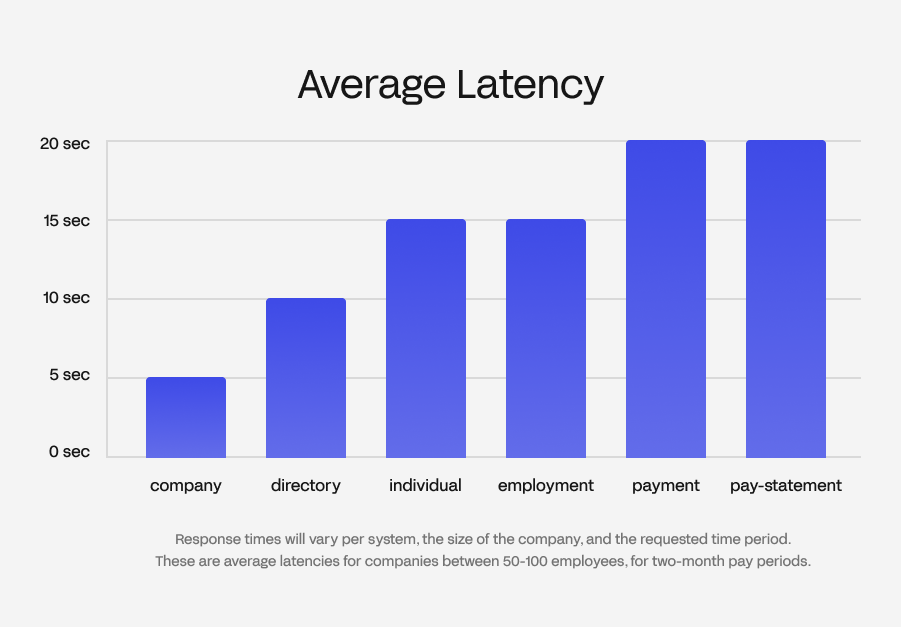

# Response Times

API response times depend on a variety of factors including but not limited to the endpoint, the employment system, and the size of the company. 

## Average response times

<!-- theme: info -->
> The above average latencies can be expected immediately after a user grants your application access to their employment system. Future API requests will take roughly the same time however there may be additional latency on occasion as Finch refreshes its session with the employment system.