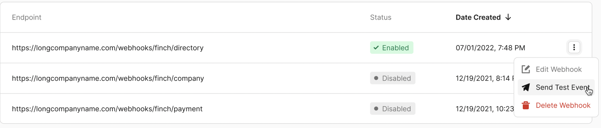

# Webhooks

Finch offers webhooks to inform you of changes to data models in a push-notification fashion, rather than you having to rely exclusively on pulling data from our API. A webhook URL is a HTTPS endpoint configured by your application to recieve requests from Finch.

<!-- theme: info -->
> Webhooks are available for customers in our Scale tier. To enable webhooks in your dashboard, reach out to your developer success representative or email developers@tryfinch.com.


## Webhook Registration
Webhook endpoints should use HTTPS and expect to receive POST requests with the following headers:
```json
{
  "Content-Type": "application/json",
  "Finch-Event-Id": "msg_2SFMDibF3lmRw8DzX4t1JjiEZQl",
  "Finch-Signature": "v1,8rFENj/WpNAMx+Kh5R1NLQunmpaBx4vOntjJdbGKbvM=",
  "Finch-Timestamp": "1688737757"
}
```

You can register webhooks via the [developer dashboard](https://dashboard.tryfinch.com/).


After registering a webhook, you will be provided with a webhook secret. This secret can be used to validate that the webhooks you receive were sent by Finch.


This secret will only be displayed once, so we recommend you store it as soon as you receive it. See the Webhook Verification section for more details.


## Webhook Payload Structure
### Common Fields
Each webhook event contains the following fields in the response body:
Field Name | Type | Description
---------|----------|---------
`company_id` | string<uuid> | Unique Finch id of the company for which data has been updated.
`account_id` | string<uuid> | Unique Finch id of the employer account that was used to make this connection. If an employer completes authorization through Finch multiple times with different accounts or API tokens, those connections will be associated with different `account_id`s.
`event_type` | string | The type of webhook being delivered.
`data` | object | More information about the associated event. The structure of this object will vary per event type.

Finch provides two general types of webhook events: account updates and job completions.

### Account Updates
Account update events contain information about account connections, such as when a connection has been established or when a connection has entered an error state. This type of webhook has the following unique schema:
Field Name | Type | Description
---------|----------|---------
`event_type` | string | Always `account.updated`.
`data.status` | string | The status of the account. This follows our standard connection status schema. Options are `pending`, `processing`, `connected`, `error_permissions`, `error_reauth`, `error_no_acount_setup`.
`data.authentication_method` | string | The method of authentication used to connect this account. Options follow the standard Finch authentication types: `credential`, `api_token`, `oauth`, and `assisted`.

Example:
```json
{
  "company_id": "720be419-0293-4d32-a707-32179b0827ab",
  "account_id": "fa872170-b49d-4fb5-aa39-fb1515db0925",
  "event_type": "account.updated",
  "data": {
    "status": "connected"
    "authentication_method": "assisted"
  }
}
```

### Job Completion
Job completion events fire when a job finishes running, whether the final state is a success or an error. This type of webhook has the following `data` schema:
Field Name | Type | Description
---------|----------|---------
`event_type` | string | Follows the schema `job.{job_type}.complete`. `{job_type}` can be any valid Finch job type such as `data_sync_all`, `benefit_create`, or `benefit_enroll`.
`data.job_id`| string<uuid> | The id of the job which has completed.
`data.job_url` | string | The url to query the result of the job.

Example:
```json
{
  "company_id": "720be419-0293-4d32-a707-32179b0827ab",
  "account_id": "fa872170-b49d-4fb5-aa39-fb1515db0925",
  "event_type": "job.benefit_enroll.completed",
  "data": {
    "job_id": "10f249d5-c974-4ce3-979a-31164323a34f",
    "job_url": "https://api.tryfinch.com/jobs/10f249d5-c974-4ce3-979a-31164323a34f"
  }
}
```


## Webhook Verification

Finch uses HMAC-SHA256 webhook verification. The following are steps you can use to verify a webhook using the verification header:

1. **Extract the signature from the header**. The `Finch-Signature` header consists of a list of signatures (space delimited) to account for secret rotations; there may be multiple signatures present for cases where a secret was rotated. During the verification process, the signature must match at least one signature in the list to be considered valid.
```json
v1,g0hM9SsE+OTPJTGt/tmIKtSyZlE3uFJELVlNIOLJ1OE= v1,bm9ldHUjKzFob2VudXRob2VodWUzMjRvdWVvdW9ldQo= v2,MzJsNDk4MzI0K2VvdSMjMTEjQEBAQDEyMzMzMzEyMwo=
```
2. **Generate the webhook secret**. Using the webhook secret, hash the webhook content in the form `{webhook_id}.{webhook_timestamp}.{body}` where body is the raw body of the request. The signature is sensitive to any changes, so even a small change in the body will cause the signature to be completely different. This means that you should not change the body in any way before verifying. If the signature does not match the value received in the `Finch-Signature` header, reject the webhook. **Note: when performing signature comparison, it is safest to use a constant-time comparison to avoid potential timing attacks.**
<!--
type: tab
title: Javascript
-->
<!--
title: "Signature generation example"
lineNumbers: true
-->
```javascript
const crypto = require('crypto');

const signedContent = `${webhook_id}.${webhook_timestamp}.${body}`
const SECRET = "5WbX5kEWLlfzsGNjH64I8lOOqUB6e8FH";

// Need to base64 decode the secret
const secretBytes = new Buffer(SECRET, "base64");
const signature = crypto
  .createHmac('sha256', secretBytes)
  .update(signedContent)
  .digest('base64');
```

<!--
type: tab
title: Python
-->
<!--
title: "Signature generation example"
lineNumbers: true
-->
```python
import hmac
import base64

signedContent = f"{webhook_id}.{webhook_timestamp}.{body}"
SECRET = "5WbX5kEWLlfzsGNjH64I8lOOqUB6e8FH"

# Need to base64 decode the secret
secretBytes = base64.b64decode(SECRET)
signature = base64.b64encode(
    hmac.new(
        secretBytes,
        signedContent.encode(),
        'sha256'
    ).digest()
).decode()

```

<!--
type: tab
title: Java
-->
<!--
title: "Signature generation example"
lineNumbers: true
-->
```java
import javax.crypto.Mac;
import javax.crypto.spec.SecretKeySpec;
import java.nio.charset.StandardCharsets;
import java.util.Base64;

public class Main {
    public static void main(String[] args) throws Exception {
        String signedContent = webhook_id + "." + webhook_timestamp + "." + body;
        String SECRET = "5WbX5kEWLlfzsGNjH64I8lOOqUB6e8FH";

        // Need to base64 decode the secret
        byte[] secretBytes = Base64.getDecoder().decode(SECRET);

        Mac sha256_HMAC = Mac.getInstance("HmacSHA256");
        SecretKeySpec secret_key = new SecretKeySpec(secretBytes, "HmacSHA256");
        sha256_HMAC.init(secret_key);

        byte[] rawHmac = sha256_HMAC.doFinal(signedContent.getBytes(StandardCharsets.UTF_8));

        // base64 encode the result
        String signature = Base64.getEncoder().encodeToString(rawHmac);
        System.out.println(signature);
    }
}
```
<!-- type: tab-end -->

3. **Verify the webhook timestamp** If the signature is valid, ensure the timestamp is not greater than five minutes in the past or future. Using outdated webhooks increases susceptibility to [replay attacks](https://en.wikipedia.org/wiki/Replay_attack).

<!--
type: tab
title: Javascript
-->
<!--
title: "Full verification example"
lineNumbers: true
-->
```javascript
import { createHmac, timingSafeEqual } from 'crypto';

interface FinchWebhookHeaders {
  'finch-event-id': string;
  'finch-signature': string;
  'finch-timestamp': string;
}

export class FinchWebhookVerifier {
  private readonly secret: Buffer;
  private readonly MAX_TIMESTAMP_AGE_MS = 5 * 60 * 1000; // 5 minutes

  constructor(secret: string) {
    // Base64 decode the secret
    this.secret = Buffer.from(secret, 'base64');
  }

  public verify(payload: string, headers: FinchWebhookHeaders): boolean {
    const signature = headers['finch-signature'];
    const timestamp = headers['finch-timestamp'];
    const eventId = headers['finch-event-id'];

    // Compare this timestamp against your system timestamp to make sure
    // it's within your tolerance in order to prevent timestamp attacks.
    // Usually we allow for a few minutes (5 min) of tolerance, but you can
    // tighten this up based on your security requirements.
    if (!this.verifyTimestamp(timestamp)) {
      // The timestamp is too old, fail the verification
      return false;
    }

    const generatedSignature = this.createSignature(
      eventId,
      timestamp,
      payload
    );
    const signatures = this.getSignatures(signature);

    return signatures.some(
        (s) => timingSafeEqual(
            Buffer.from(s),
            Buffer.from(generatedSignature)
        ));
  }

  // The signature header is composed of a list of signatures and their corresponding version identifier.
  // For example: "v1,signature1 v1,signature2"
  // Usually there is only one signature, but in case of a key rotation there
  // might be multiple valid signatures until the old key has expired (after 24h).
  // We return all signatures so that the caller can check if any of them is valid.
  private getSignatures(signature: string): string[] {
    return signature.split(' ').map((s) => {
      const [_, value] = s.split(',');
      return value;
    });
  }

  // Create a HMAC SHA256 hash using the secret and the signed payload and encode it as base64
  private createSignature(
    eventId: string,
    timestamp: string,
    payload: string
  ): string {
    const signedPayload = `${eventId}.${timestamp}.${payload}`;
    return createHmac('sha256', this.secret)
      .update(signedPayload)
      .digest('base64');
  }

  private verifyTimestamp(timestamp: string): boolean {
    // Get the current time
    const now = Date.now();
    // The timestamp is in seconds, but we need milliseconds
    const timestampMs = Number(timestamp) * 1000;
    // Check that the timestamp is not older than MAX_TIMESTAMP_AGE_MS
    return Math.abs(now - timestampMs) < this.MAX_TIMESTAMP_AGE_MS;
  }
}
```

<!--
type: tab
title: Python
-->
<!--
title: "Full verification example"
lineNumbers: true
-->
```python
import base64
import hashlib
import hmac
from typing import Dict

class FinchWebhookVerifier:
    def __init__(self, secret: str):
        self.secret = base64.b64decode(secret)
        self.MAX_TIMESTAMP_AGE_MS = 5 * 60 * 1000  # 5 minutes

    def verify(self, payload: str, headers: Dict[str, str]) -> bool:
        signature = headers['finch-signature']
        timestamp = headers['finch-timestamp']
        eventId = headers['finch-event-id']

        if not self.verify_timestamp(timestamp):
            return False

        generated_signature = self.create_signature(eventId, timestamp, payload)
        signatures = self.get_signatures(signature)

        return any(hmac.compare_digest(s, generated_signature) for s in signatures)

    def get_signatures(self, signature: str) -> list:
        return [value for _, value in (s.split(',') for s in signature.split(' '))]

    def create_signature(self, eventId: str, timestamp: str, payload: str) -> str:
        signed_payload = f'{eventId}.{timestamp}.{payload}'.encode('utf-8')
        hmac_digest = hashlib.sha256(self.secret + signed_payload).digest()
        return base64.b64encode(hmac_digest).decode('utf-8')

    def verify_timestamp(self, timestamp: str) -> bool:
        now = int(time.time() * 1000)
        timestamp_ms = int(timestamp) * 1000
        return abs(now - timestamp_ms) < self.MAX_TIMESTAMP_AGE_MS
```

<!--
type: tab
title: Java
-->
<!--
title: "Full verification example"
lineNumbers: true
-->
```java
import javax.crypto.Mac;
import javax.crypto.spec.SecretKeySpec;
import java.nio.charset.StandardCharsets;
import java.security.MessageDigest;
import java.util.Base64;
import java.util.HashMap;
import java.util.List;
import java.util.ArrayList;

public class FinchWebhookVerifier {
    private byte[] secret;
    private static final long MAX_TIMESTAMP_AGE_MS = 5 * 60 * 1000; // 5 minutes

    public FinchWebhookVerifier(String secret) {
        this.secret = Base64.getDecoder().decode(secret);
    }

    public boolean verify(String payload, HashMap<String, String> headers) {
        String signature = headers.get("finch-signature");
        String timestamp = headers.get("finch-timestamp");
        String eventId = headers.get("finch-event-id");

        if (!verifyTimestamp(timestamp)) {
            return false;
        }

        String generatedSignature = createSignature(eventId, timestamp, payload);
        List<String> signatures = getSignatures(signature);

        for (String s : signatures) {
            byte[] sBytes = s.getBytes(StandardCharsets.UTF_8);
            byte[] generatedSignatureBytes = generatedSignature.getBytes(StandardCharsets.UTF_8);
            if (MessageDigest.isEqual(sBytes, generatedSignatureBytes)) {
                return true;
            }
        }
        return false;
    }

    private List<String> getSignatures(String signature) {
        List<String> signatures = new ArrayList<>();
        String[] parts = signature.split(" ");
        for (String part : parts) {
            String[] keyValue = part.split(",");
            signatures.add(keyValue[1]);
        }
        return signatures;
    }

    private String createSignature(String eventId, String timestamp, String payload) {
        try {
            String signedPayload = eventId + "." + timestamp + "." + payload;
            Mac sha256HMAC = Mac.getInstance("HmacSHA256");
            SecretKeySpec secretKey = new SecretKeySpec(secret, "HmacSHA256");
            sha256HMAC.init(secretKey);
            byte[] hmacDigest = sha256HMAC.doFinal(signedPayload.getBytes("UTF-8"));
            return Base64.getEncoder().encodeToString(hmacDigest);
        } catch (Exception e) {
            throw new RuntimeException("Failed to create signature", e);
        }
    }

    private boolean verifyTimestamp(String timestamp) {
        long now = System.currentTimeMillis();
        long timestampMs = Long.parseLong(timestamp) * 1000;
        return Math.abs(now - timestampMs) < MAX_TIMESTAMP_AGE_MS;
    }
}

```
<!-- type: tab-end -->

## Testing Webhooks

You can send a test request to any webhook through the developer dashboard.




The test webhook will include the same structure as data update webhooks, with the `event_type` set to `test`

## Retries

Upon failure, Finch will retry according to the following schedule with exponential backoff:

- Immediately
- 5 seconds
- 5 minutes
- 30 minutes
- 2 hours


## Best Practices for Handling Webhooks

**Responding to Webhooks**

In order to prevent unnecessary retries, we recommend receiving webhook events and processing the events in separate processes. Upon receiving the event, you should immediately respond with a `200` indicating that the event was successfully delivered.

**Event delivery and ordering**

- It is possible that you may occasionally receive the same webhook event more than once. We recommend setting up idempotent event processing by using the `Finch-Event-Id`.
- Finch does not guarantee delivery of events in the order they happen. For example, you may receive an `update` event for an `individual` before a `created` event. You should also use the Finch API to occasionally fetch any missing data. For example, you can fetch an individual if you happen to receive an `update` event first.

**Event Mapping**

- Webhooks are delivered with a `company_id` and an `account_id` corresponding to the company for which the data changed. You should retrieve these ids from Finch in order to map webhooks updates to the company/account pair the data belongs to. A simple workflow for this is to call the `/introspect` endpoint after exchanging an auth code for an access token via the `/auth/token` endpoint. The `/introspect` endpoint contains the `company_id` and `account_id` for the connection a token is associated with. You can save these ids in your system to map incoming webhook events to companies.
