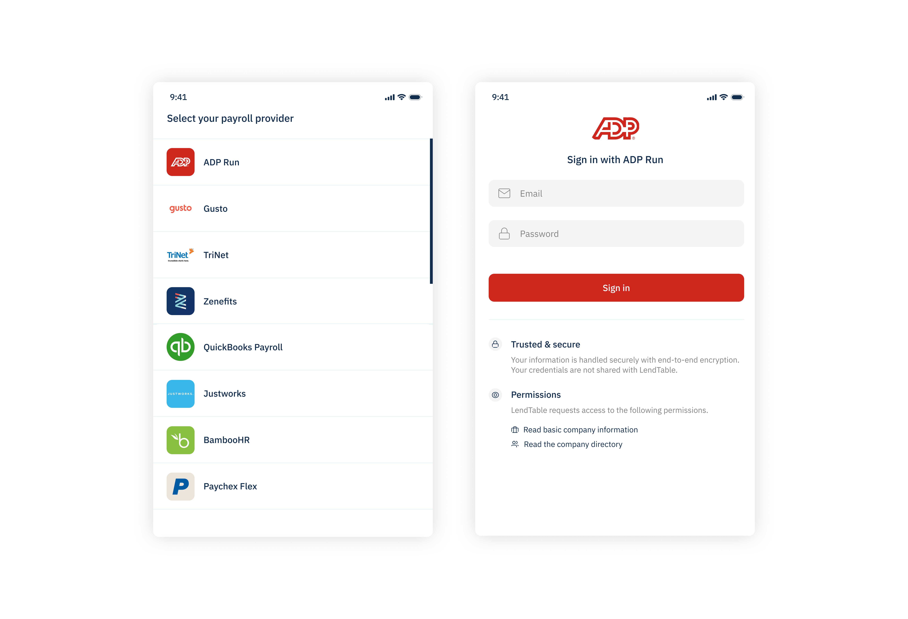

## Authorization

Authorization allows applications to authorize and interact with payroll and HRIS providers using the Finch API.

### Redirect URIs

To authorize with Finch, you'll need to provide one or more redirect URIs. The user will be redirected to the specified URI upon authorization. On redirect, the URI will contain an authorization code query parameter that must be exchanged with Finch's authorization server for an access token.

The redirect URIs must match one of the following formats—


Protocol | Format | Examples
---------|----------|---------
 HTTP | A localhost URI with protocol `http://` | `http://localhost:8000`
 HTTPS | A URI with protocol `https://` | `https://myapplication.com`

### Finch Connect

Finch Connect provides a secure and elegant authorization flow for your users. By going through Connect, your users can easily and securely grant your application permissions to interact with their payroll account.



Connect contains the following steps—
1. **Redirect to Finch Connect** - Your application redirects the user to the Finch Connect authorization flow. 
2. **Authenticate user and obtain consent** - Finch Connect prompts the user to log in with their payroll credentials. Once logged in, the user will be asked to grant your application access to a specific scope of permissions.
3. **Handle response** - If the user successfully accepted the permissions, Finch Connect will redirect the user back to your application using the specified redirect_uri with an authorization code. If an error occurs, Finch Connect will redirect the user to your application with an error message.

### Redirect to Connect

When your application needs to access a user’s payroll data, redirect them to Connect.

Construct the Connect redirect with the parameters below— 


Parameter | Required | Description
---------|----------|---------
 `client_id` | true | The application’s unique identifier.
 `redirect_uri` | true | The URI a user will be redirected to after authorization. This value must match one of the redirect URIs set on the dashboard.
 `product` | true | A space-separated list of products that your application is requesting access to.
 `payroll_provider` | false | An optional parameter that allows users to bypass the provider selection screen. Compatible payrolls are: `rippling`, `gusto`, `justworks`, and `quickbooks`.

**Example**

```curl
https://connect.tryfinch.com/authorize?
&client_id=8229df9f-91a0-4ff0-a1ae-a1f38ee24d07
&product=directory
&redirect_uri=https://tryfinch.com
```

### Connect prompts for consent

There are two parts to this step. First, the user will be asked to select their payroll provider and to log in with their payroll credentials. If the login is successful, Connect will display a consent window that shows the name of your application and the products your application is requesting access to. The end-user can approve or deny the set of products.

### Handle response

Connect sends the end user’s approval or denial back to your application’s server via the specified redirect URI.

**Success**

If the user grants your application access, the redirect to your application will contain the following query parameters.

```http
HTTP/1.1 302 Found
Location: https://example.com/home?
code=90abecb6-e7ab-4b85-864a-e1c8bf67f2ad
```

Parameter | Required | Description
---------|----------|---------
 `code` | true | An authorization code that will be used to obtain an access token in the following step. The authorization code expires after 10 minutes.


