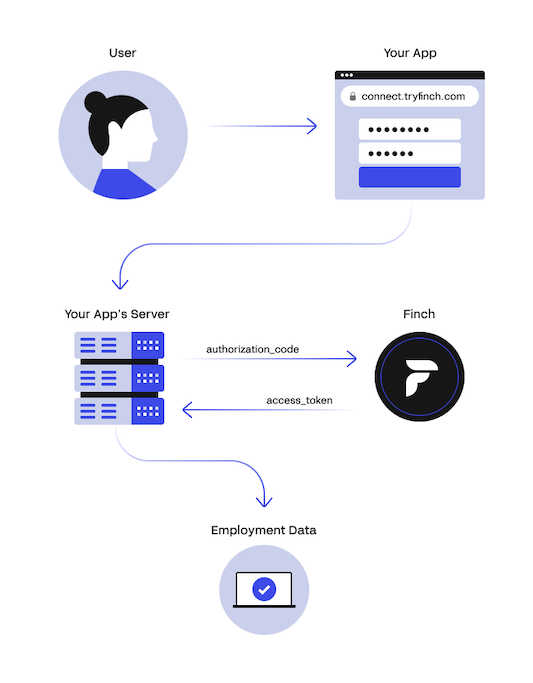

# How Finch Works

The Finch flow begins when your user (a business owner, HR or payroll administrator, etc) wants to connect their employment system to your application.

<!--
focus: false
-->

1. Your application front-end redirects your user to Connect, Finch's OAuth 2.0 based authorization flow, which guides your user through granting you access to their employment system.
2. Your front-end receives an authorization `code` after your user successfully grants your application access.
3. Your front-end sends the short-lived `code` to your application server, which exchanges it for a long-lived `access_token`.
4. Your application server saves the `access_token`, representing your access to your user's system, to read data and push changes.
