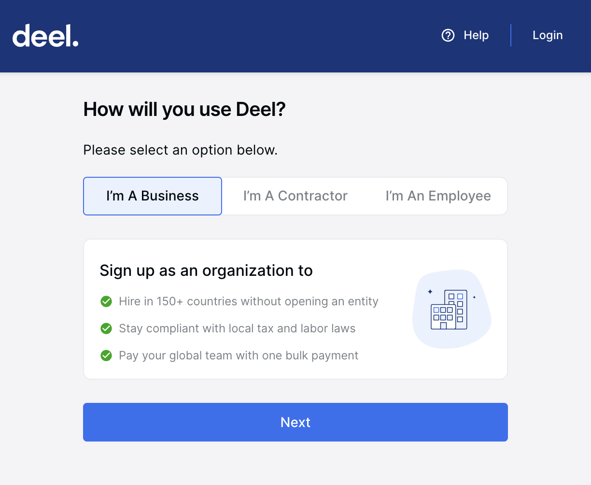
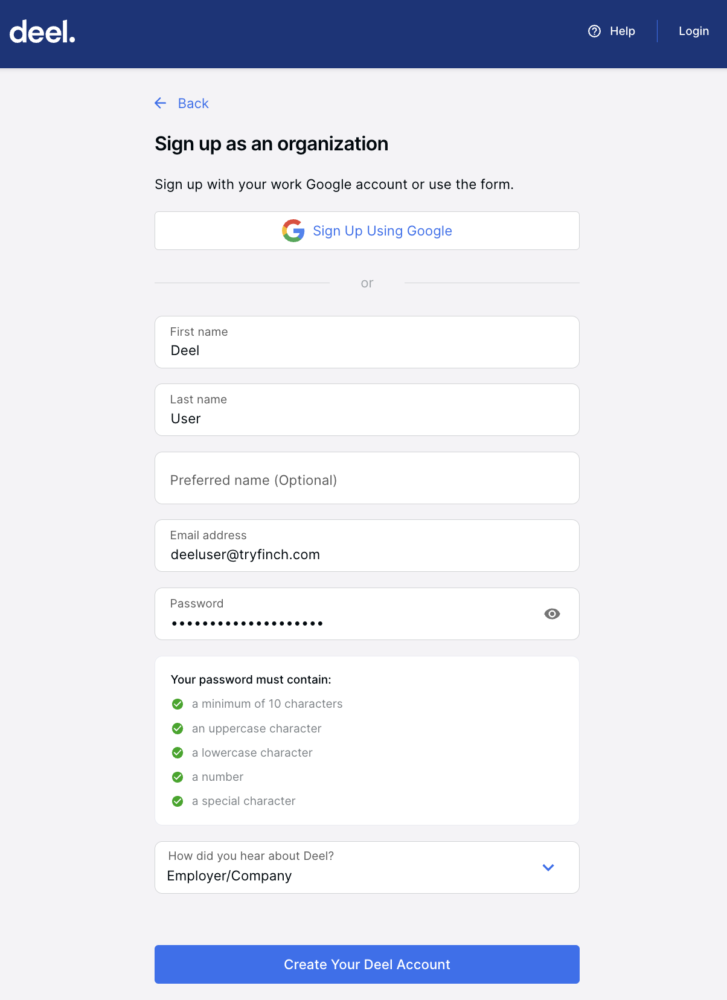
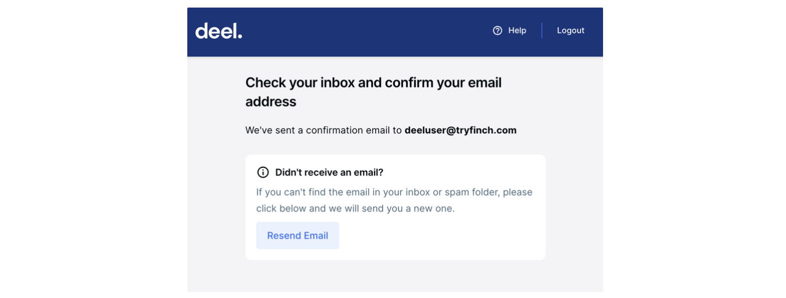
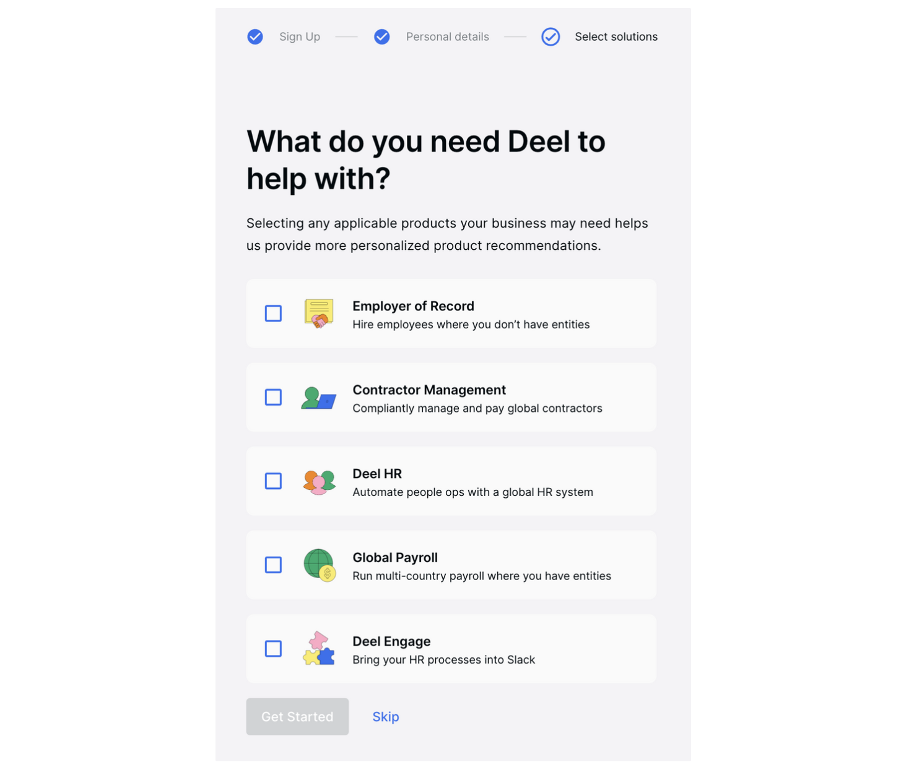

# Deel Onboarding Guide!

> Integrating Deel via Finch makes your organization eligible for the Deel Partner Program. This includes go-to-market motions and revenue share opportunities with Deel. If you are interested or have already built an app, reach out here to learn more about the program.

Integrating with Deel through Finch is a simple 3-step process! To get set up, you need to:

1. Create a Deel account
1. Create a Deel OAuth application
1. Connect your Deel OAuth application to Finch

This page explains each of these steps in detail. Happy integrating!

## Create a Deel account

If your company does not already have an account with Deel, you’ll need to create one. To create an account, follow the instructions below.

1. Navigate to https://app.deel.com/signup in your browser
1. Select the **I’m A Business** option and click **Next**

    

1. Either **Sign Up Using Google SSO** or fill in the form below and select **Create Your Deel Account**

    

1. If your form was submitted successfully, you’ll be taken to a confirmation page. You should now have received an email confirmation in your inbox. Open this email and follow the ensuing instructions to log into your generated account. 

    

1. After logging into your account, follow the ensuing instructions to complete your account setup. When prompted with the solutions selection page, you may select ********Skip,******** and proceed with the remaining steps to complete your setup.

    

1. Voila! Your account setup is now complete! You should now be looking at your Deel home page, which should look something like the screenshot below.

    
