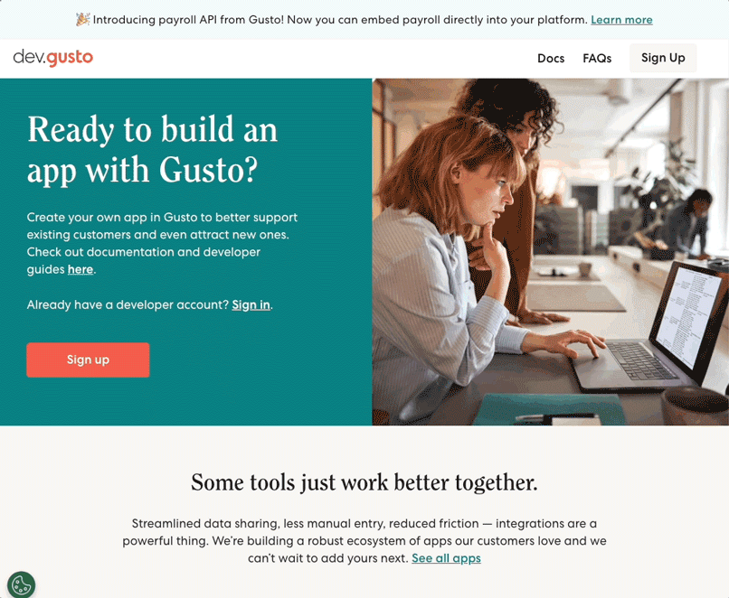

# Gusto Onboarding and Migration Guide

> **Attention: Finch customers using the existing Gusto integration** 📣
> 
> To avoid interruptions to your service, please complete the migration process and have your customers reauthorize by **November 30th, 2023** (see Step 5 below for more details).

Before gaining access to Gusto’s production API, all developers are subject to Gusto’s standard security and compliance review. As an official Gusto development partner, Finch will work closely with you to support you through your onboarding journey. The onboarding process consists of the following steps:

**[Step 1](#step-1-create-an-account-in-gustos-developer-portal):** Create an account in Gusto’s Developer Portal

**[Step 2](#step-2-complete-gustos-onboarding-questionnaire):** Complete the Gusto Onboarding Questionnaire

**[Step 3](#step-3-assist-gusto-security-review):** Assist Gusto Security Review

**[Step 4](#step-4-id-migration-for-existing-users):** (Optional) Let your Finch Developer Success representative know if you need your Finch IDs to remain stable with your current integration.

**[Step 5](#step-5-connect-your-clients):** Connect your Clients!

The remainder of this page outlines these steps in greater detail.

---

### Step 1: Create an account in Gusto’s Developer Portal

**[5 minutes]**

Gusto requires that all developers be set up in their Developer Portal. Finch offers a managed service by default where we will create and manage your DevPortal "organization" - all you need to do is [sign up for a DevPortal account](https://dev.gusto.com/accounts/sign_up) and we’ll take it from there. Please reach out to your Success manager or developers@tryfinch.com if you have any questions.

<!--
focus: false
-->

### Step 2: Complete Gusto’s Onboarding Questionnaire

**[30 minutes to 1 hour]**

Please fill out this [Finch-specific onboarding questionnaire](https://gusto.az1.qualtrics.com/jfe/form/SV_1Oob0rNZpUwhSoS?Partner=Finch). The questionnaire will ask you about your company, Gusto integration requirements, and your security and control environment (such as whether you have physical security controls, if data is encrypted, etc.). Please **ensure to include all supporting documents** as they will be necessary for Gusto to complete the review.

The requirements for each developer will depend upon the sensitivity of the data access requested. If you have a SOC 2 Type 2 Report, ISO 27001 Certificate, or PCI Certificate, you will be shown a simplified questionnaire and your review process will be expedited. **If you do not have one of these reports, and you require data access to sensitive PII (e.g., benefits data), please contact your Developer Success representative to discuss further.**

We understand that answering the questionnaire can be time-consuming but it is a necessary step in ensuring that your application meets Gusto’s data security requirements. In rare cases, Gusto may not approve an application for production access for a reason other than security concerns, such as for a use case Gusto prohibits on their platform (e.g. mature content, etc.). If you have questions on how to respond to a specific question, please don’t hesitate to reach out to our Developer Success team.

### Step 3: Assist Gusto Security Review

**[1 to 2 weeks]**

After you submit the questionnaire, Gusto will conduct a security review via a third party called VISO Trust. The VISO Trust process typically takes one week. In most cases, nothing further will be needed from you; however, VISO Trust may reach out for additional information or clarification. Please respond to these requests timely, as any delays could impact when production access will be made available to you. 

Once you have been approved, the Gusto team will enable production access and issue credentials within their Developer Portal. Gusto will then apply the appropriate data scopes that were requested as part of the security questionnaire to your configuration, thereby adhering to the security principle of least privilege. Finch will be notified by Gusto to take those credentials and activate the API integration for your account. Finch will notify you once your integration has been successfully activated.

If you are not approved for production access for security reasons, Gusto will work with us and you to resolve those issues within a reasonable timeframe.

### Step 4: ID Migration for Existing Users

**[1 to 2 weeks]**

> **Optional:** If you do not require Finch to maintain the same Finch IDs when migrating to the new integration, this step can be skipped and Finch can make your new Gusto integration available to end users immediately.

Please note that with this migration, there will be some changes to the underlying data that Finch uses for generating [Finch IDs (UUIDs)](https://developer.tryfinch.com/docs/reference/82e937086502a-handling-api-responses) for employees, payments, and benefits. As such, your integration may experience a change in the Finch IDs that represent the aforementioned entities. If you currently rely on Finch IDs remaining stable, please follow the steps below to ensure their stability while migrating to the new integration:

1. Let your Developer Success representative know you wish to preserve the existing Finch IDs. Once we receive your Gusto OAuth credentials, we will temporarily pause new connections by removing Gusto from Finch Connect and discontinue any recurring data syncs.
1. We will work with Gusto to map your old IDs to new IDs, so that existing references are compatible with the API integration.
1. We will then reactivate your Gusto integration, add Gusto back as an integration option to Finch Connect, and invite your users to reauthorize the Finch connection.

### Step 5: Connect your Clients!

> **Attention: Finch customers using the existing Gusto integration** 📣
>
> Finch's existing Gusto integration and associated connections are being decommissioned on **November 30, 2023**. Please be sure to notify your clients in advance that they will need to reauthorize through Finch Connect by this date to keep their connections alive. For any questions or concerns, please reach out to your Finch Developer Success representative.
>
> We understand that these changes may cause some inconvenience, and appreciate your partnership during this transition.

Finch will be notified by Gusto as soon as your account credentials are ready for use to activate your API integration. Finch will notify you once your integration has been activated. Your clients can then go through Finch Connect and connect to their Gusto account to authorize your application for data access!

---

If you have any questions, please do not hesitate to reach out to your Finch Developer Success representative. We look forward to working with you to provide a seamless integration with Gusto. We understand that this process can be complex and we are here to help you every step of the way.