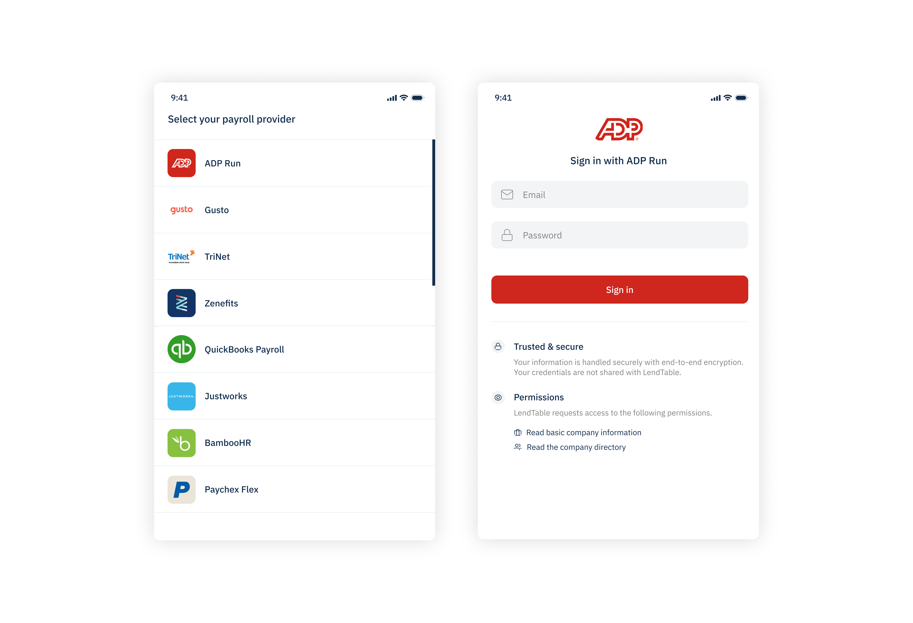

# Connect

Finch Connect is a front-end UI that allows your users to safely and securely grant your application access to their employment systems. Connect can be displayed in any part of your application and handles credential validation, multi-factor authentication, and error handling for each system we support.

---

## Integrating Connect into your product

To create the best experience for your users and ensure maximum conversion, you will want to consider the following questions when designing your user journey—

1. When should my user connect their employment system?
2. How should I launch Connect for my user?
3. How do I incentivize my user to connect their system?

### When should my user connect?

We recommend asking your user to connect when they are onboarding onto your application for the first time because prompting them to connect later takes considerable effort to have them log on again. Since Finch maintains long-lived access, your users will not need to go through any additional effort after the initial onboarding. 

### How should I display Connect?

In the default flow, your user is shown an employment system selector page where they can choose which system they use. 

If you already know which system your user uses or want to build your own selector page, you can bypass the selector page by using the `payroll_provider` option while opening Connect.

### How do I incentivize my user to connect their system?

To improve conversion, it is important to set user expectations before opening Connect. We recommend letting the user know they will be asked to connect their employment system and, importantly, why connecting is beneficial for them.

## Connect in your user's onboarding

If you are integrating Finch into your onboarding flow, we recommend taking the request latencies of the underlying employment systems into consideration while designing the onboarding flow. You can read more about latencies here.

Based on the data points your application needs during onboarding, we recommend the following flows—

1. For `/company` and/or `/directory` data points, we recommend designing a synchronous flow where your user goes through Connect, your application sends API requests to Finch, waits for the responses, and then renders the UI.
2. For data from other endpoints, we recommend _simulating_ a synchronous flow where your user goes through Connect, your application kicks off API requests in the background, your user continues with the rest of the onboarding flow, and then finally use the data when all API requests have resolved. This will allow you to build a single UI/UX for organizations of all sizes.
