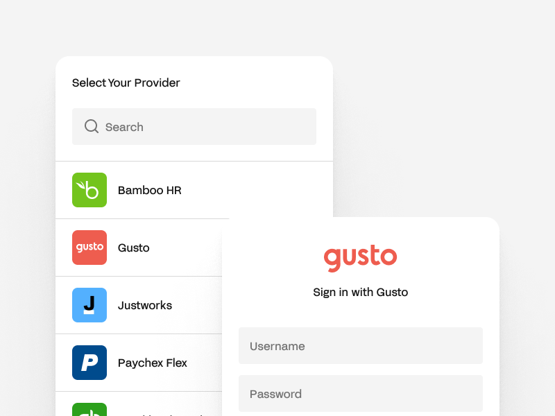
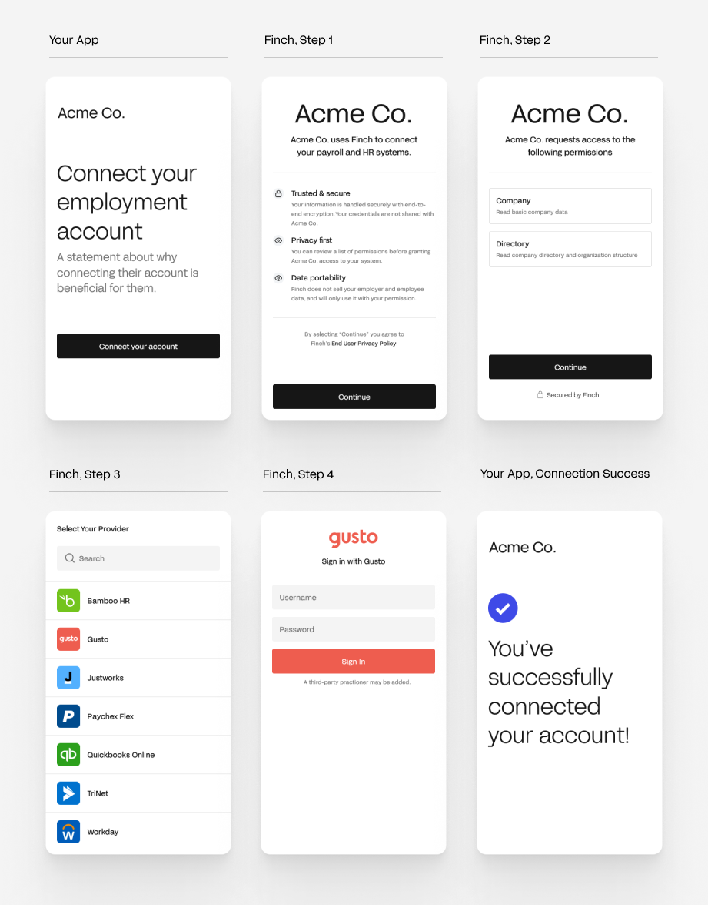
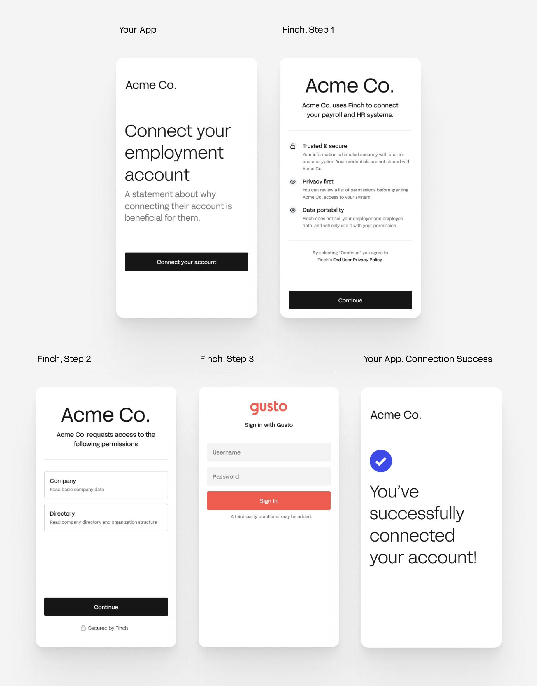
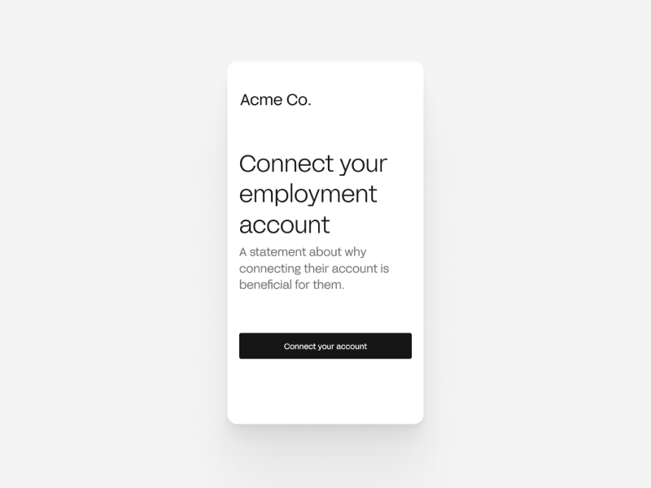

# Automated Connect Flow

Finch Connect is a front-end UI that allows your users to safely and securely grant your application access to their employment systems. Connect can be displayed in any part of your application and handles credential validation, multi-factor authentication, and error handling for each system we support.

<!--
focus: false
-->

---

## Integrating Finch Connect Into Your Product

To create the best experience for your users and ensure maximum conversion, you will want to consider the following questions when designing your user journey—

1. When should my user connect their employment system?
2. How should I launch Finch Connect for my user?
3. How do I incentivize my user to connect their system?

### When should my user connect?

We recommend asking your user to connect when they are onboarding onto your application for the first time because prompting them to connect later takes considerable effort to have them log on again. Since Finch maintains long-lived access, your users will not need to go through any additional effort after the initial onboarding.

### How should I display Finch Connect?

#### Default flow

In the default flow, your user is shown an employment system selector page where they can choose which system they use.

<!--
focus: false
-->

#### Selector bypass flow

If you already know which system your user uses or want to build your own selector page, you can bypass the selector page by using the `payroll_provider` option while opening Finch Connect.

<!--
focus: false
-->

#### Authentication Method Configuration
Finch often offers several methods of authentication to end employers. Some integrations offer the option for employers to authenticate using credentials, while others also offer OAuth or direct API token input. These methods have different tradeoffs regarding reliability and access to data, and Finch works to give maximal optionality in the way data access happens. Finch allows you as the developer to choose which auth methods you want to expose to your end customers and in which priority. Finch offers a primary and secondary auth method that can be set for each provider and also can hide certain auth methods if you wish. For example, if you would only like to expose the OAuth auth method to BambooHR customers, Finch can hide the credential auth method in Finch Connect for you. Get in touch with your Finch representative if you would like a specific auth configuration, and we can manage it for you.

#### Authentication Fallback
Authentication Fallback is an opt-in feature for *Scale* tier customers which allows employers to authorize through Finch Connect even when Finch is experiencing intermittent issues with provider integrations. This feature applies only to credential authentication methods, and not to other authentication methods like direct API token entry or OAuth.

If an employer attempts to authenticate through Finch Connect’s automated flow and receives an error, after three attempts*, Finch Connect will display instructions for the employer to connect Finch manually. This entails the employer adding Finch as a third-party user to the employer’s system. Once Finch has accepted the invite and set up the account, the data for this connection will flow through the Finch API just as it does for every other automated connection. The only key difference is that until the connection is set up on Finch’s side, **your application will receive a 202 response when making requests with that token.** Therefore, your application should be set up to handle 202 response codes from Finch. Please reach out to your Finch account manager if you would like to enable this feature.

*the number of errors before presenting the fallback screen is configurable. Currently it is set to three for every provider, but we may adjust this value over time.

### How do I incentivize my user to connect their system?

To improve conversion, it is important to set user expectations before opening Finch Connect. We recommend letting the user know they will be asked to connect their employment system and, importantly, why connecting is beneficial for them.

<!--
focus: false
-->

## Finch Connect in Your User's Onboarding

If you are integrating Finch into your onboarding flow, we recommend taking the request latencies of the underlying employment systems into consideration while designing the onboarding flow. You can read more about latencies [here](../Development-Guides/Data-Syncs.md).

Based on the data points your application needs during onboarding, we recommend the following flows—

1. For `/company` and/or `/directory` data points, you can design a synchronous flow where your user goes through Finch Connect, your application sends API requests to Finch, waits for the responses, and then renders the UI.
2. For data from other endpoints, we recommend _simulating_ a sychronous flow. Here, your user goes through Finch Connect and your application kicks off API requests in the background. While the requests are being resolved, your user goes through the rest of the onboarding flow. Finally, once the API requests are resolved, your application renders the appropriate UI, creating a sense of immediacy.
