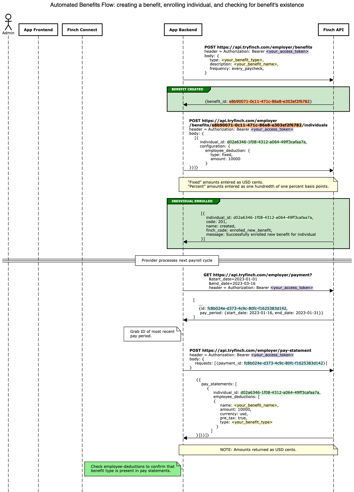
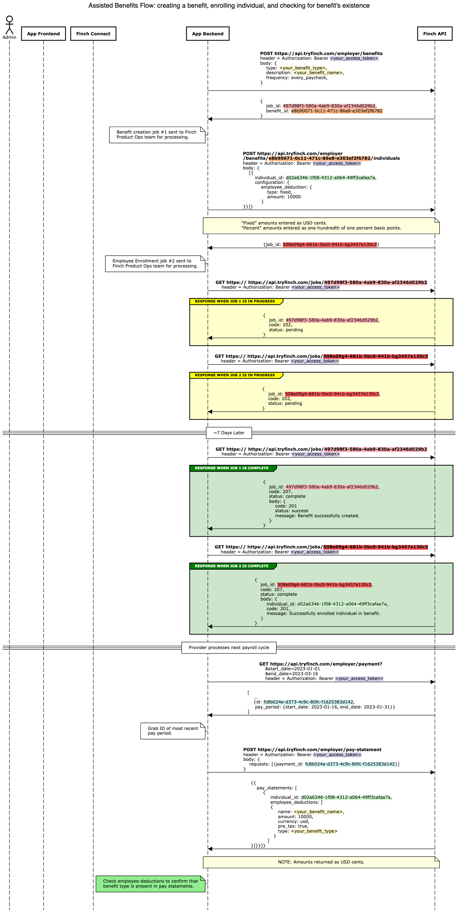

# Integrating the Benefits API


Finch's [Benefits API](https://developer.tryfinch.com/docs/reference/b3A6MTg4Mzc2MTk-create-benefit) endpoints allow developers to read and write contributions and deductions across HRIS providers for retirement, medical, and fringe benefits using a single, unified API.

Finch’s Benefits API operates at two levels: the company level and the employee level. Our API allows you to:

- Create, read, and update benefits at the company level
- Manage enrollments for company benefits at the employee level

**Note: one-time post-tax deductions are not currently supported**

## Setup

There are several steps you should take to ensure a smooth Benefits onboarding experience before beginning implementation.

**Read our API docs to understand the functionality and required parameters of each of our Benefits endpoints. Some highlights:**
- [Create a New Benefit](https://developer.tryfinch.com/docs/reference/48b2addc6de34-create-benefit)
- [Enroll Individuals](https://developer.tryfinch.com/docs/reference/eb8994494966c-enroll-individuals-in-benefits)
- [Unenroll Individuals](https://developer.tryfinch.com/docs/reference/d52800ec818bd-unenroll-individuals-from-benefits)

**Prepare for provider limitations**
    
Providers have varying limitations on which operations are available and which actions can be performed via Finch’s API. For example, you should be prepared for providers which do not allow for benefit creation and design your workflow to accommodate those cases. As Finch encounters new provider limitations, we add them to our [field support docs](../Development-Guides/Field-Support/Benefits-Support.md). For each of the limited providers, you should confirm with the employer that the correct benefits are set up in the system prior to the company authenticating through Finch Connect. If you try to enroll an employee in a benefit that is not set up, you may receive a 422 response code from Finch indicating that the benefit is not set up by the company. In these cases, you should reach out to the employer to ensure the benefits have been correctly set up.
    
**Understand Assisted vs Automated Connections**
    
Finch offers two methods of fulfilling API requests: assisted and automated. Assisted integration requests are fulfilled by our operations team, and so have slight differences in behavior and functionality compared to automated integrations.
    
- [Review Assisted SLAs](https://developer.tryfinch.com/docs/reference/8c540ddeca222-assisted-connect-flow#for-you)
- [Read more about Assisted Benefits](./Benefits-API.md#automated-vs-assisted-connections)

## Getting and Creating Company Benefits

Our API allows you to both [create new benefits](https://developer.tryfinch.com/docs/reference/b3A6MTg4Mzc2MTk-create-benefit) in a payroll system and [get existing benefits](https://developer.tryfinch.com/docs/reference/b3A6MTg4Mzc2MTg-get-all-benefits) from the system. Both of these requests will respond with a `benefit_id` in the response body. For example, a creation request will respond with:

```json
{
  "benefit_id": "e8b90071-0c11-471c-86e8-e303ef2f6782"
}

```

You can use this `benefit_id` to perform enrollment, un-enrollment, and benefit retrieval actions on individuals.

### **Using benefits metadata**

The types and features of each benefit can vary between payroll systems depending on the configuration that the company has set up. For this reason, we provide a [`/benefits/meta`](https://developer.tryfinch.com/docs/reference/b3A6MTg4Mzc2MjA-get-benefits-metadata) endpoint, which will provide the types and features available for the employer whose benefits you are managing. If you try to make a request using an access token that does not allow a certain configuration or benefit type, our API will respond with a 400 or 422 status code (see [Errors](https://developer.tryfinch.com/docs/reference/1f80003f67f0d-error-types)), depending on the error. This endpoint can help you avoid those errors by understanding beforehand what types of requests you can make.

This information is also available in [our documentation](https://developer.tryfinch.com/docs/reference/cc0d83f948d99-benefits-support).

Please note that for providers supported via Assisted Benefits, only **benefits-enabled** providers have the `/benefits/meta` endpoint implemented. This is because Finch must first connect to a provider system in order to create an accurate benefit mapping. **Until a provider is benefits-enabled, Finch will return a 202 status code from the `/benefits/meta` endpoint, and will return 501s for all other benefits endpoints for that provider**. Once we have performed the benefit mapping to the provider system, we will remove the 202 and return the standardized **`/benefits/meta`** response, and begin allowing benefits requests through. Please see the [Providers page](https://developer.tryfinch.com/docs/reference/96f5be9e0ec1a-providers) for which providers are currently benefits-enabled, and see our [Assisted Connect SLAs](https://developer.tryfinch.com/docs/reference/8c540ddeca222-assisted-connect-flow#for-you) for enabling new benefits providers.

## Enrolling and Unenrolling Individuals

### Creating new enrollments

Enrolling a new individual is as simple as using the `benefit_id` returned from the company benefits endpoints above, and using it in a [`POST /benefits/{benefit_id}/individuals`](https://developer.tryfinch.com/docs/reference/b3A6MjE4NDU0NTU-enroll-individuals-in-benefits) request. In the body, you should provide a list of objects which specify the enrollment, one per individual. Each object should contain a flexible `configuration` object which specifies the enrollment configuration to applies to that individual. The schema of the configuration varies depending on the type of benefit you are enrolling, so please refer to the docs to ensure you are using the right schema.

### Updating existing enrollments

To update enrollment configurations for currently enrolled individuals, you can use the same `POST /benefits/{benefit_id}/individuals` endpoint that you use to enroll new individuals. When updating an existing enrollment for an individual, the enrollment configuration will be completely overwritten with the new configuration provided in the request, so please make sure to include the entire desired configuration. Since they both use the same endpoint, these update requests can be submitted in the same batch request as new enrollment requests.

### Un-enrolling individuals

You can unenroll individuals by using the [`DELETE /benefits/{benefit_id}/individuals`](https://developer.tryfinch.com/docs/reference/b3A6MjE4NDU0NTY-unenroll-individuals-from-benefits) endpoint. This will remove the enrollment configuration for an individual.

## Automated vs Assisted Connections

Requests made for Benefits connections to automated providers will be fulfilled synchronously, so the response you receive from the `/employer/benefits` endpoints will contain the results of the request. For providers which support Benefits via Assisted, the response you receive from the `/employer/benefits` endpoints will contain a `job_id`. While our dedicated product operations team makes the necessary changes in the provider's system, you can continue to call  `GET /jobs/{job_id}` to get the status of the job. The valid job status responses will be either `pending`, `in_progress`, `complete`, or `error` with a response body further explaining the response.

Example `POST /employer/benefits` response:

```json
{
  "benefit_id": "264122c0-0216-4f21-a4cd-7b3bcddbe3fc",
  "job_id": "497d98f3-580a-4ab9-830a-af2346d029b2"
}

```

Example `POST /employer/benefits/{benefit_id}/individuals` response:

```json
{
  "job_id": "3a82a144-d168-4207-942a-a5852b11df1c"
}

```

This will be the same for `DELETE /employer/benefits/{benefit_id}/individuals`

Example `GET /jobs/{job_id}` response after initial job submission:

```json
{
  "job_id": "3a82a144-d168-4207-942a-a5852b11df1c",
  "code": 202,
 "status": "pending"
}

```

Example `GET /jobs/{job_id}` response after job is completed for a `POST /employer/benefits/individuals` request with multiple individuals:

```json
{
 "job_id": "3a82a144-d168-4207-942a-a5852b11df1c",
  "code": 207,
  "status": "complete",
 "body": [
    {
      "individual_id": "430f9d95-1dcf-4b99-b616-45f814416890",
      "code": 201,
      "message": "Successfully enrolled individual in benefit",
    },
    {
      "individual_id": "647975ac-1e0f-4e9c-b705-e3042da48581",
      "code": 200,
      "message": "Successfully updated enrollment for individual",
    },
    {
      "individual_id": "4a0a3b15-d3d6-41c2-a4a4-ca4ed1b68cf8",
      "code": 404,
      "message": "Individual not found"
    },
    ...
  ]
}

```

These diagrams further explain the difference between the assisted and automated Benefits workflows:

**Automated Benefits Sequence Diagram**



**Assisted Benefits Sequence Diagram**




Today, the following endpoints are available via Assisted Benefits:

- `POST /employer/benefits` to create a new company-wide benefit or individual deduction
- `POST /employer/benefits/{benefit_id}/individuals` to enroll employee(s) in an existing benefit or deduction
- `POST /employer/benefits/{benefit_id}` to update an existing company-wide benefit or individual deduction
- `GET /employer/benefits/meta` to list the available benefit types and configurations for the provider associated with the access token
- `DELETE /employer/benefits/{benefit_id}/individuals`* to unenroll individuals from a benefit

Assisted Benefits integrations **do not support reading** benefits data from providers:

- `GET /employer/benefits` to list all company-wide benefits
- `GET /employer/benefits/{benefit_id}` to list benefit information for a given benefit
- `GET /employer/benefits/{benefit_id}/enrolled` to list individuals currently enrolled in a given benefit
- `GET /employer/benefits/{benefits_id}/individuals` to get enrolled benefit information for the given individuals

## Handling Failures

Managing benefits is a time and money-sensitive activity. Therefore, in the unlikely event that a benefit request through Finch fails, we recommend that your team have a process in place to handle enrollments or to inform employers. We recommend leaving adequate buffer between request submission via Finch and payroll cutoff dates to account for time to address issues. Our recommendation is that you submit a request with enough time to have at least 1 day between the response from Finch and the cutoff date. For an automated connection, that means submitting the request at least 24 hours before the cutoff. For an assisted connection, the recommended time is 8 days to account for the 7 day SLA for enrolling benefits.

Enrollment and un-enrollment requests and responses are batched. This means that some enrollments/un-enrollments could succeed while others fail.

For automated providers, you should inspect the `body` object of the response body to discern failures. Note that the top-level response status code will be a 207, but may be individual errors. Example:

```json
Top-level status code: 207
[
  {
    "individual_id": "d02a6346-1f08-4312-a064-49ff3cafaa7a",
    "code": 500,
    "body": {
      "name": "internal_server_error",
      "message": "Internal sever error"
    }
  },
  {
    "individual_id": "e63c21ab-7cde-49d8-b6d6-ce208e84bf09",
    "code": 500,
    "body": {
      "name": "internal_server_error",
      "message": "Internal sever error"
    }
  }
]
```

Assisted providers will follow a similar format, but on the `/jobs` endpoint instead. Example:
```json
Top-level status code: 200
{
  "job_id": "497d98f3-580a-4ab9-830a-af2346d029b2",
  "status": "complete",
  "body": [
    {
      "individual_id": "430f9d95-1dcf-4b99-b616-45f814416890",
      "code": 500,
      "message": "Internal server error"
    },
    {
      "individual_id": "647975ac-1e0f-4e9c-b705-e3042da48581",
      "code": 404,
      "message": "Individual not found"
    }
  ]
}
```

## General Benefits Information

Since enrolling benefits can be a sensitive activity, it is helpful to understand some of the nuances around payroll and benefits in general.

### How do payroll benefit deductions work?

Each payroll contains four important dates to know.

1. Payroll Start Date - The first day of the pay period
2. Payroll End Date - The last day of the pay period
3. Payroll Close Date - The last date to make changes for that pay period
4. Paycheck Date - The date on which employees are paid

When considering benefits, it is important to submit any employee benefit changes before the pay close date in order to take affect for the current pay period. If any changes are submitted after the payroll close date, they will only affect the next pay period, not the current. Since each payroll close date is different per provider, it is important to know this date and set proper expectations with your customers.

Finch offers two API modes: Automated and Assisted.

You can review [our list of valid providers](https://developer.tryfinch.com/docs/reference/96f5be9e0ec1a-providers) to see which providers are automated vs assisted for the Benefits endpoints.

### Benefits submissions

For assisted benefits connections, it is important to submit payroll benefit deductions to our API 7 days before the customer’s payroll close date. This will help ensure that changes can be processed within the current payroll period (unless explicitly specified otherwise in your API request).

**Example**

As an example, if the payroll period is **June 1 - 15**. The payroll close date might be **June 16** so payroll can be processed before **Friday, June 17**.  Therefore, it would be important to submit payroll deductions via the Finch API by **June 9** for those to take effect during the June 1 - 15 payroll.

<pre>
June 2022
Su Mo Tu We Th Fr Sa
          <mark style="background-color: lightblue">1  2  3  4
 5  6  7  8  9 10 11
12 13 14 15</mark> <mark style="background-color: yellow">16</mark> <mark style="background-color: green">17</mark> 18
19 20 21 22 23 24 25
26 27 28 29 30
</pre>

Some payroll providers offer a dedicated payroll representative to help with making payroll changes. If a payroll rep is helping your customer’s HR admin with changes in their system, it is important that you make it explicitly clear who does what so that the payroll rep does not overwrite any changes Finch has previously made. Calling out Benefit Code types and using thoughtful benefit descriptions (e.g. with your company name) help.


## Testing benefits

### Sandbox

You can [use the benefits endpoints in the Finch Sandbox](https://developer.tryfinch.com/docs/reference/ZG9jOjMxOTg1NTMw-testing#testing-benefits). This supports read operations (`GET` requests) and stubbed out write operations (`POST` requests), meaning writes will not actually change any internal state and reads will always return the same responses.

### Live Accounts


If you would like to test our Benefits product against a real account, please reach out to a Finch representative so we can set you up with a testing environment.
