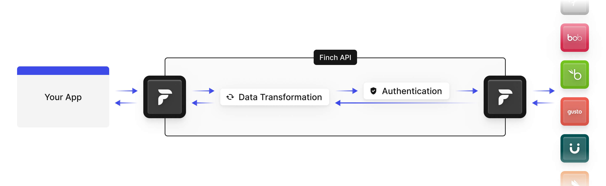

# Finch Forward: Passthrough API

## Enabling Custom Data Requests

Finch Forward is a passthrough API that enables you to issue raw requests directly against an integration. With Finch Forward, you have the ability to access any functionality that is natively supported by an integration. You’ll be able to access data elements that are outside of Finch’s existing API structure and standard data model. You’ll also be able to write data elements that are outside the scope of what is supported through one of Finch’s standardized APIs.

### Using Finch Forward

// Loom Video?

// Use case examples?

### Supported Integrations

> Finch Forward supports Finch's API-based integrations. For providers that have both API and non-API based authentication methods, Finch Forward is only supported for connections that were established via the API-based auth method.

API documentation for the systems that are currently supported by Finch Forward are referenced below.

* **HiBob:** [API Documentation](https://apidocs.hibob.com/reference)
* **Personio:** [API Documentation](https://developer.personio.de/reference)

For specifics on how to make requests using Finch Forward, please refer to the API reference for `/forward`.

### Why Finch Forward?

For each supported integration, Finch provides a standardized set of API endpoints and data models. However, if you require additional information outside this standard model, Finch Forward enables your application to read or write specific fields from provider-supported API endpoints. This supplements the standardized endpoints and fields without needing to handle the complexities of building and managing a separate integration yourself for accessing non-standardized fields.

For example, consider a situation where Finch’s data model supports 95% of the fields your application needs. Instead of having to build a direct integration with the provider to get the other 5% of fields you need, you can look to Finch Forward. After all, building and maintaining a single integration is the reason you chose Finch in the first place! With the Forward API, you could gain access to the other 5% of the data you need.

When using the Forward API, Finch leverages the existing connection that was established via Finch Connect, forwards the request to the provider, and then forwards the provider’s response back to your application. It is important to note that Finch Forward does not alter requests or responses, it simply forwards them between you and the provider while managing credentials through the connection authentication step for you.

### How it Works

**Finch's Standard API**

Requests to one of Finch’s standard API endpoints go through a data transformation layer to ensure that you have a consistent request and response structure to work with, regardless of the system you’re extracting data from.

**Finch Forward API**

Requests using Finch Forward bypass the data transformation layer, giving you access to the raw data exposed by an integration and leaving the data mapping fully in your control.

For more details on making requests using Finch Forward, please refer to the API reference for `/forward`.